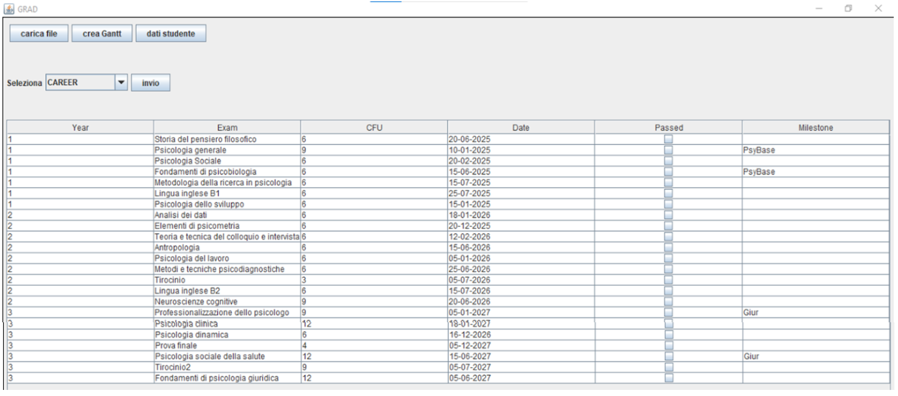
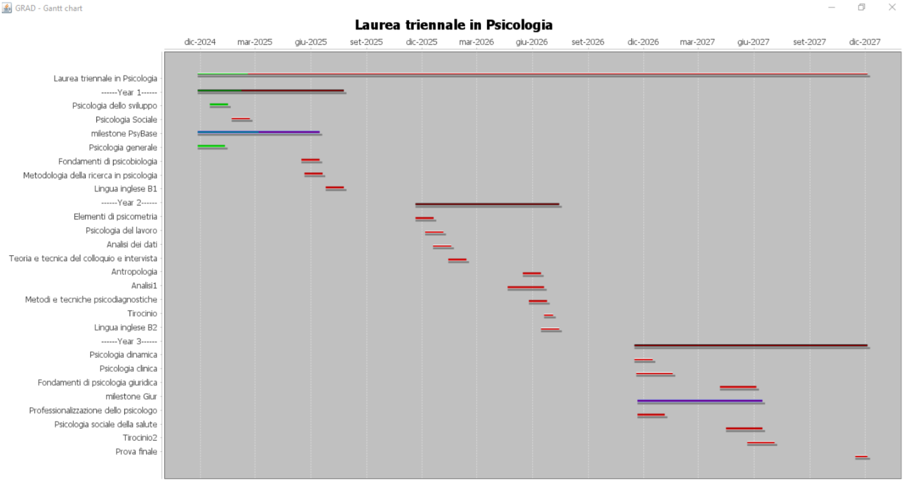
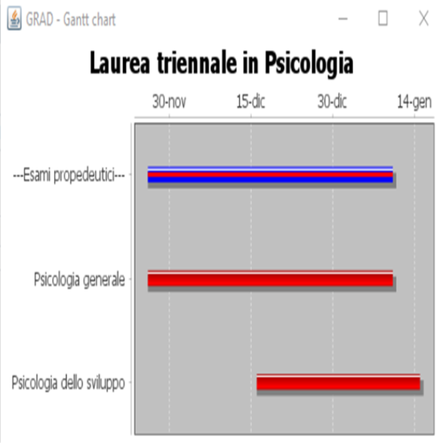
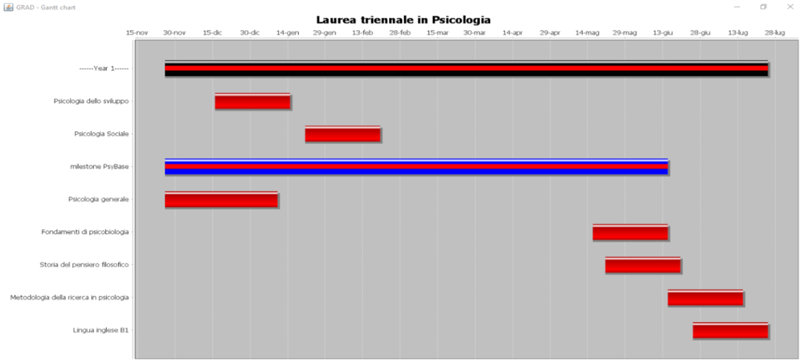
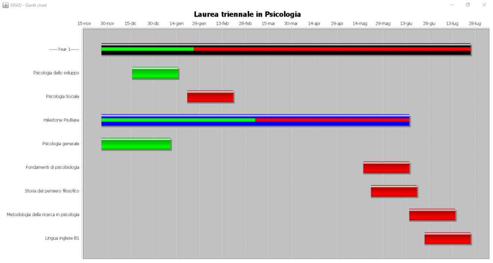

# GRAD

- [Manuale Utente](https://docs.google.com/document/d/1-xVcrvf3Gv0_ktjn3BYRLdLm__i7DGcvBZsS717SyS0/edit?usp=drivesdk)

- [Documentazione Tecnica](https://docs.google.com/document/d/1dWWYBH2Nr3rc3W0u43n7Ouomw4CL6Sz9LkW8AwAAy_M/edit?usp=drivesdk)

## Overview
GRAD è un'applicazione Desktop progettata per aiutare gli studenti universitari nella pianificazione del proprio percorso accademico.
I dati vengono inseriti in dei file di configurazione dedicati:
- il file in formato GRAD, contenente gli anni di studio e relativi esami per il piano studi di ciascuno;
- il file in formato YAML, contenente propedeuticità obbligatorie e consigliate per gli esami del file GRAD.

GRAD offre una dashboard sommaria che permette di ottenere una prospettiva sui dati, con opzioni di filtraggio per anno, propedeutica (obbligatoria o consigliata) e moduli (detti <i>milestone</i>).

GRAD consente di creare rappresentazioni grafiche ispirate agli strumenti GANTT utilizzati nel project management, semplificando la visualizzazione temporale del proprio piano di studi. L'idea è di consentire agli studenti di comprendere rapidamente lo stato dei propri piani, individuando sovrapposizioni e stato di completamento delle collezioni di esami, aggregati secondo l'anno di appartenenza o vincoli di modularità.

Esempio di visualizzazione aggregata per modulo "PsyBase", dove "psicologia generale" è inoltre parte degli esami propedeutici:

Esempio di visualizzazione aggregata per anno "Year 1":

GRAD consente di aggiornare lo stato degli esami, riportando il proprio progresso riempiendo la barra di completamento delle aggregazioni di riferimento.

